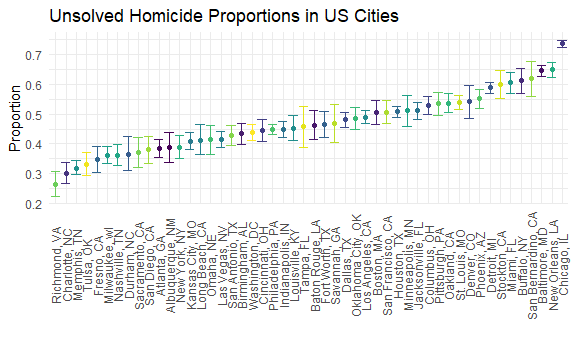

p8105_hw5_waa2119
================
William Anderson
2022-11-07

``` r
library(tidyverse)
library(lubridate)

knitr::opts_chunk$set(
  fig.width = 6,
  fig.asp = .6,
  out.width = "90%"
)

theme_set(theme_minimal() + theme(legend.position = "bottom"))

options(
  ggplot2.continuous.colour = "viridis",
  ggplot2.continuous.fill = "viridis"
)

scale_colour_discrete = scale_colour_viridis_d
scale_fill_discrete = scale_fill_viridis_d
```

## Problem 2

First we read in the homicide data from the Washington Post

``` r
homicide_data = 
  read_csv("homicide/homicide-data.csv", na = "") %>%
  
  janitor::clean_names() %>%
  
  mutate(
    reported_date = ymd(reported_date))
```

    ## Rows: 52179 Columns: 12
    ## ── Column specification ────────────────────────────────────────────────────────
    ## Delimiter: ","
    ## chr (9): uid, victim_last, victim_first, victim_race, victim_age, victim_sex...
    ## dbl (3): reported_date, lat, lon
    ## 
    ## ℹ Use `spec()` to retrieve the full column specification for this data.
    ## ℹ Specify the column types or set `show_col_types = FALSE` to quiet this message.

``` r
head(homicide_data, 10)
```

    ## # A tibble: 10 × 12
    ##    uid      reported…¹ victi…² victi…³ victi…⁴ victi…⁵ victi…⁶ city  state   lat
    ##    <chr>    <date>     <chr>   <chr>   <chr>   <chr>   <chr>   <chr> <chr> <dbl>
    ##  1 Alb-000… 2010-05-04 GARCIA  JUAN    Hispan… 78      Male    Albu… NM     35.1
    ##  2 Alb-000… 2010-02-16 MONTOYA CAMERON Hispan… 17      Male    Albu… NM     35.1
    ##  3 Alb-000… 2010-06-01 SATTER… VIVIANA White   15      Female  Albu… NM     35.1
    ##  4 Alb-000… 2010-01-01 MENDIO… CARLOS  Hispan… 32      Male    Albu… NM     35.1
    ##  5 Alb-000… 2010-01-02 MULA    VIVIAN  White   72      Female  Albu… NM     35.1
    ##  6 Alb-000… 2010-01-26 BOOK    GERALD… White   91      Female  Albu… NM     35.2
    ##  7 Alb-000… 2010-01-27 MALDON… DAVID   Hispan… 52      Male    Albu… NM     35.1
    ##  8 Alb-000… 2010-01-27 MALDON… CONNIE  Hispan… 52      Female  Albu… NM     35.1
    ##  9 Alb-000… 2010-01-30 MARTIN… GUSTAVO White   56      Male    Albu… NM     35.1
    ## 10 Alb-000… 2010-02-10 HERRERA ISRAEL  Hispan… 43      Male    Albu… NM     35.1
    ## # … with 2 more variables: lon <dbl>, disposition <chr>, and abbreviated
    ## #   variable names ¹​reported_date, ²​victim_last, ³​victim_first, ⁴​victim_race,
    ## #   ⁵​victim_age, ⁶​victim_sex

This data comprises information about 52,000 homicides in 50 U.S. cities
over the past decade. Using public records, the Washington Post acquired
information about a decade of homicides including victim names, race,
sex, age, location, and whether an arrest had been made.

The size of the dataset is 52179, 12

The columns included are uid, reported_date, victim_last, victim_first,
victim_race, victim_age, victim_sex, city, state, lat, lon, disposition

The uid represents the identification number of each homicide within
each city and the disposition variable represents whether an arrest has
been made for the homicide.

Now we will create a city_state variable (e.g. “Baltimore, MD”) and then
summarize within cities to obtain the total number of homicides and the
number of unsolved homicides (those for which the disposition is “Closed
without arrest” or “Open/No arrest”).

``` r
homicide_data_tidy = 
  
  homicide_data %>%
  
   mutate(city_state = str_c(city, ", ", state)) %>%
  
  mutate(unsolved = ifelse(disposition == "Closed without arrest" | disposition == "Open/No arrest", 1, 0)) %>%
  
  group_by(city_state) %>%
  
  summarize(total_homicides = n(), total_unsolved = sum(unsolved))

head(homicide_data_tidy, 25)
```

    ## # A tibble: 25 × 3
    ##    city_state      total_homicides total_unsolved
    ##    <chr>                     <int>          <dbl>
    ##  1 Albuquerque, NM             378            146
    ##  2 Atlanta, GA                 973            373
    ##  3 Baltimore, MD              2827           1825
    ##  4 Baton Rouge, LA             424            196
    ##  5 Birmingham, AL              800            347
    ##  6 Boston, MA                  614            310
    ##  7 Buffalo, NY                 521            319
    ##  8 Charlotte, NC               687            206
    ##  9 Chicago, IL                5535           4073
    ## 10 Cincinnati, OH              694            309
    ## # … with 15 more rows

Now for the city of Baltimore, MD, we will use the prop.test function to
estimate the proportion of homicides that are unsolved and analyze the
estimated proportion and confidence intervals from the resulting tidy
dataframe.

``` r
homicide_baltimore = 
  
  homicide_data_tidy %>%
  
  filter(city_state %in% "Baltimore, MD") %>%
  
  mutate(
    prop_test = list(broom::tidy(prop.test(total_unsolved, total_homicides)))) %>%
  
  unnest(prop_test) %>%
  
  select(city_state, total_unsolved, total_homicides, estimate, conf.low, conf.high)

head(homicide_baltimore, 10)
```

    ## # A tibble: 1 × 6
    ##   city_state    total_unsolved total_homicides estimate conf.low conf.high
    ##   <chr>                  <dbl>           <int>    <dbl>    <dbl>     <dbl>
    ## 1 Baltimore, MD           1825            2827    0.646    0.628     0.663

Now we will run prop.test for each of the cities and extract both the
proportion of unsolved homicides and the confidence interval for each.

``` r
prop_tests_homicides = 
  
   homicide_data_tidy %>%
  
  mutate(
    prop_test = map2(.x = total_unsolved, .y = total_homicides, ~prop.test(x = .x, n = .y))) %>%
  
  mutate(
    prop_test_broom = map(prop_test, broom::tidy)) %>%
  
  unnest(prop_test_broom) %>%
  
  select(city_state, total_unsolved, total_homicides, estimate, conf.low, conf.high)

head(prop_tests_homicides, 10)
```

    ## # A tibble: 10 × 6
    ##    city_state      total_unsolved total_homicides estimate conf.low conf.high
    ##    <chr>                    <dbl>           <int>    <dbl>    <dbl>     <dbl>
    ##  1 Albuquerque, NM            146             378    0.386    0.337     0.438
    ##  2 Atlanta, GA                373             973    0.383    0.353     0.415
    ##  3 Baltimore, MD             1825            2827    0.646    0.628     0.663
    ##  4 Baton Rouge, LA            196             424    0.462    0.414     0.511
    ##  5 Birmingham, AL             347             800    0.434    0.399     0.469
    ##  6 Boston, MA                 310             614    0.505    0.465     0.545
    ##  7 Buffalo, NY                319             521    0.612    0.569     0.654
    ##  8 Charlotte, NC              206             687    0.300    0.266     0.336
    ##  9 Chicago, IL               4073            5535    0.736    0.724     0.747
    ## 10 Cincinnati, OH             309             694    0.445    0.408     0.483

Now we will create a plot that shows the estimates and confidence
intervals for each city and organize the cities according to the
proportion of unsolved homicides.

``` r
  prop_tests_homicides =
  
  prop_tests_homicides %>%
  
    filter(!city_state %in% "Tulsa, AL")

  ggplot(prop_tests_homicides, aes(x = reorder(city_state, estimate), y = estimate, group = city_state, color = city_state)) + 
    
    geom_point() + 
    
  geom_errorbar(aes(ymin = conf.low, ymax = conf.high)) +
    
    theme(axis.text.x = element_text(angle = 90, vjust = 0.5), legend.position = "none") + 
    
    labs(title = "Unsolved Homicide Proportions in US Cities", 
         
         x = "", 
         
         y = "Proportion")
```



## Problem 3

Now we will conduct a simulation to explore power in a one-sample
t-test.

First we set the following design elements:

Fix n=30 Fix σ=5 Set μ=0.

Then we will generate 5000 datasets from the model with parameters:

x∼Normal\[μ,σ\]

For each dataset, we will save μ_hat and the p-value arising from a test
of H:μ=0 using α=0.05.

``` r
n = 30

t_dist = function(n, mu, sigma = 5) {
  
  norm_data = tibble(x = rnorm(n, mean = mu, sd = sigma))
  
  broom::tidy(t.test(norm_data, alternative = "two.sided", conf.level = 0.95))
  
}

t_test_results = 
  
  expand_grid(
    sample_size = n,
    mu = 0:6,
    iter = 1:300) %>%
  
  mutate(
    t_test = map2(.x = sample_size, .y = mu, ~t_dist(n = .x, mu = .y))) %>%
  
  unnest(t_test)

head(t_test_results, 10)
```

    ## # A tibble: 10 × 11
    ##    sample_s…¹    mu  iter estim…² stati…³ p.value param…⁴ conf.…⁵ conf.…⁶ method
    ##         <dbl> <int> <int>   <dbl>   <dbl>   <dbl>   <dbl>   <dbl>   <dbl> <chr> 
    ##  1         30     0     1  0.0696  0.0628  0.950       29  -2.20    2.33  One S…
    ##  2         30     0     2  0.921   1.12    0.273       29  -0.764   2.61  One S…
    ##  3         30     0     3 -0.299  -0.361   0.721       29  -1.99    1.40  One S…
    ##  4         30     0     4 -2.62   -2.48    0.0190      29  -4.78   -0.462 One S…
    ##  5         30     0     5  0.179   0.177   0.861       29  -1.89    2.25  One S…
    ##  6         30     0     6 -0.430  -0.428   0.672       29  -2.49    1.63  One S…
    ##  7         30     0     7  0.839   0.769   0.448       29  -1.39    3.07  One S…
    ##  8         30     0     8  1.25    1.39    0.176       29  -0.592   3.08  One S…
    ##  9         30     0     9 -0.885  -0.980   0.335       29  -2.73    0.963 One S…
    ## 10         30     0    10  0.984   0.899   0.376       29  -1.26    3.22  One S…
    ## # … with 1 more variable: alternative <chr>, and abbreviated variable names
    ## #   ¹​sample_size, ²​estimate, ³​statistic, ⁴​parameter, ⁵​conf.low, ⁶​conf.high

Now we will make a plot showing the proportion of times the null was
rejected (the power of the test) on the y axis and the true value of μ
on the x axis.

``` r
t_test_results %>%
  
  group_by(mu) %>%
  
  filter(p.value < 0.05) %>%
  
  summarize(proportion = n()) %>%
  
  ggplot(aes(x = mu, y = proportion, color = mu, group = mu)) +
  
  geom_point() + 
  
  labs(title = "Power vs different mean values", 
       y = "Power value",
       
       x = "True mu") +
  
  theme(legend.position = "none") +
  
  scale_x_continuous(breaks = 0:6)
```


When effect size increases, so does the power of the test as there is a
strong relationship between the two variable which causes the
probability of correctly rejecting the null hypothesis to increase as
there is a likely association between the variables.

We see this is true from the graph as the magnitude of the difference
between the mean and the null hypothesis increases, the power also
increases. This makes sense since the null hypothesis is mu = 0 and the
difference in means is increasing with increasing mu which means there
is more likely to be a true difference and a rejection of the null
hypothesis, which is equivalent to a higher power value.

Now we will make a plot showing the average estimate of μ_hat on the y
axis and the true value of μ on the x axis.

``` r
t_test_results %>%
  
  group_by(mu) %>%
  
  summarize(mean_mu_hat = mean(estimate)) %>%
  
  ggplot(aes(x = mu, y = mean_mu_hat, group = mu, color = mu)) + 
  
  geom_point() + 
  
  theme(legend.position = "none") +
  
  labs(title = "Estimated mu vs True mu",
       
       x = "True mu",
       
       y = "Estimated mu") +
  
  scale_x_continuous(breaks = 0:6) +
  
  scale_y_continuous(breaks = 0:6)
```


Now we will make a second plot showing the average estimate of μ_hat
only in samples for which the null was rejected on the y axis and the
true value of μ on the x axis.

``` r
t_test_results %>%
  
  group_by(mu) %>%
  
  filter(p.value < 0.05) %>%
  
  summarize(mean_mu_hat = mean(estimate)) %>%
  
    ggplot(aes(x = mu, y = mean_mu_hat, group = mu, color = mu)) + 
  
  geom_point() + 
  
  theme(legend.position = "none") +
  
  labs(title = "Estimated mu vs True mu when null is rejected",
       
       x = "True mu", 
       
       y = "Estimated mu") +
  
  scale_x_continuous(breaks = 0:6) +
  
  scale_y_continuous(breaks = 0:6)
```


The average estimate of mu_hat across tests for which the null is
rejected is only approximately equal to the true value of mu when the
effect size becomes large as we see in the graph that the estimate
approximates the true mean for mu = 4, 5, and 6 which shows that the
effect size needs to be large enough and thus the power of the test be
large enough for the null to be accurately rejected so that the estimate
accurately approximates the true mean.
