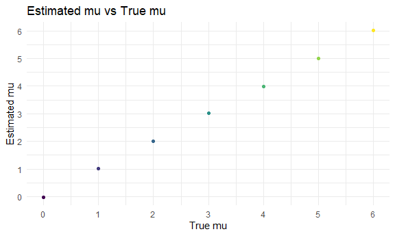

p8105_hw5_waa2119
================
William Anderson
2022-11-07

``` r
library(tidyverse)

knitr::opts_chunk$set(
  fig.width = 6,
  fig.asp = .6,
  out.width = "90%"
)

theme_set(theme_minimal() + theme(legend.position = "bottom"))

options(
  ggplot2.continuous.colour = "viridis",
  ggplot2.continuous.fill = "viridis"
)

scale_colour_discrete = scale_colour_viridis_d
scale_fill_discrete = scale_fill_viridis_d
```

## Problem 2

First we read in the homicide data from the Washington Post

``` r
homicide_data = 
  read_csv("homicide/homicide-data.csv", na = "") %>%
  
  janitor::clean_names()
```

    ## Rows: 52179 Columns: 12
    ## ── Column specification ────────────────────────────────────────────────────────
    ## Delimiter: ","
    ## chr (9): uid, victim_last, victim_first, victim_race, victim_age, victim_sex...
    ## dbl (3): reported_date, lat, lon
    ## 
    ## ℹ Use `spec()` to retrieve the full column specification for this data.
    ## ℹ Specify the column types or set `show_col_types = FALSE` to quiet this message.

``` r
head(homicide_data, 10)
```

    ## # A tibble: 10 × 12
    ##    uid   repor…¹ victi…² victi…³ victi…⁴ victi…⁵ victi…⁶ city  state   lat   lon
    ##    <chr>   <dbl> <chr>   <chr>   <chr>   <chr>   <chr>   <chr> <chr> <dbl> <dbl>
    ##  1 Alb-…  2.01e7 GARCIA  JUAN    Hispan… 78      Male    Albu… NM     35.1 -107.
    ##  2 Alb-…  2.01e7 MONTOYA CAMERON Hispan… 17      Male    Albu… NM     35.1 -107.
    ##  3 Alb-…  2.01e7 SATTER… VIVIANA White   15      Female  Albu… NM     35.1 -107.
    ##  4 Alb-…  2.01e7 MENDIO… CARLOS  Hispan… 32      Male    Albu… NM     35.1 -107.
    ##  5 Alb-…  2.01e7 MULA    VIVIAN  White   72      Female  Albu… NM     35.1 -107.
    ##  6 Alb-…  2.01e7 BOOK    GERALD… White   91      Female  Albu… NM     35.2 -107.
    ##  7 Alb-…  2.01e7 MALDON… DAVID   Hispan… 52      Male    Albu… NM     35.1 -107.
    ##  8 Alb-…  2.01e7 MALDON… CONNIE  Hispan… 52      Female  Albu… NM     35.1 -107.
    ##  9 Alb-…  2.01e7 MARTIN… GUSTAVO White   56      Male    Albu… NM     35.1 -107.
    ## 10 Alb-…  2.01e7 HERRERA ISRAEL  Hispan… 43      Male    Albu… NM     35.1 -107.
    ## # … with 1 more variable: disposition <chr>, and abbreviated variable names
    ## #   ¹​reported_date, ²​victim_last, ³​victim_first, ⁴​victim_race, ⁵​victim_age,
    ## #   ⁶​victim_sex

This data comprises 52,000 homicides in 50 large U.S. cities over the
past decade. Using public records, the Washington Post acquired
information about a decade of homicides including victim names, race,
sex, age, location, and whether an arrest had been made.

The size of the dataset is 52179, 12

The columns included are uid, reported_date, victim_last, victim_first,
victim_race, victim_age, victim_sex, city, state, lat, lon, disposition

Now we will create a city_state variable (e.g. “Baltimore, MD”) and then
summarize within cities to obtain the total number of homicides and the
number of unsolved homicides (those for which the disposition is “Closed
without arrest” or “Open/No arrest”).

``` r
homicide_data_tidy = 
  
  homicide_data %>%
  
   mutate(city_state = str_c(city, ", ", state)) %>%
  
  mutate(unsolved = ifelse(disposition == "Closed without arrest" | disposition == "Open/No arrest", 1, 0)) %>%
  
  group_by(city_state) %>%
  
  summarize(total_homicides = n(), total_unsolved = sum(unsolved))

head(homicide_data_tidy, 25)
```

    ## # A tibble: 25 × 3
    ##    city_state      total_homicides total_unsolved
    ##    <chr>                     <int>          <dbl>
    ##  1 Albuquerque, NM             378            146
    ##  2 Atlanta, GA                 973            373
    ##  3 Baltimore, MD              2827           1825
    ##  4 Baton Rouge, LA             424            196
    ##  5 Birmingham, AL              800            347
    ##  6 Boston, MA                  614            310
    ##  7 Buffalo, NY                 521            319
    ##  8 Charlotte, NC               687            206
    ##  9 Chicago, IL                5535           4073
    ## 10 Cincinnati, OH              694            309
    ## # … with 15 more rows

Now for the city of Baltimore, MD, we will use the prop.test function to
estimate the proportion of homicides that are unsolved and analyze the
estimated proportion and confidence intervals from the resulting tidy
dataframe.

``` r
homicide_baltimore = 
  
  homicide_data_tidy %>%
  
  filter(city_state %in% "Baltimore, MD") %>%
  
  mutate(
    prop_test = list(broom::tidy(prop.test(total_unsolved, total_homicides)))) %>%
  
  unnest(prop_test) %>%
  
  view
```

Now we will run prop.test for each of the cities and extract both the
proportion of unsolved homicides and the confidence interval for each.

output = map(city_state, prop.test) output = map2(.x = input_1, .y =
input_2, \~func(arg_1 = .x, arg_2 = .y))

``` r
prop_tests_homicides = 
  
   homicide_data_tidy %>%
  
  mutate(prop_test = map2(.x = total_unsolved, .y = total_homicides, ~prop.test(x = .x, n = .y))) %>%
  mutate(prop_test_broom = map(prop_test, broom::tidy)) %>%
  unnest(prop_test_broom) %>%
  select(city_state, total_unsolved, total_homicides, estimate, conf.low, conf.high) %>%
  view
```

    ## Warning in prop.test(x = .x, n = .y): Chi-squared approximation may be incorrect

Create a plot that shows the estimates and CIs for each city – check out
geom_errorbar for a way to add error bars based on the upper and lower
limits. Organize cities according to the proportion of unsolved
homicides.

``` r
  prop_tests_homicides =
  prop_tests_homicides %>%
    filter(!city_state %in% "Tulsa, AL")

  ggplot(prop_tests_homicides, aes(x = reorder(city_state, estimate), y = estimate, color = city_state)) + 
    
    geom_point() + 
    
  geom_errorbar(aes(ymin = conf.low, ymax = conf.high)) +
    
    labs(title = "Unsolved Homicide Proportions in US Cities", 
         x = "", 
         y = "Proportion", 
         color = "Location") + 
    
    theme(legend.position = "right") +
    
  scale_x_discrete(guide = guide_axis(check.overlap = TRUE))
```


## Problem 3

n this problem, you will conduct a simulation to explore power in a
one-sample t-test.

First set the following design elements:

Fix n=30 Fix σ=5 Set μ=0. Generate 5000 datasets from the model

x∼Normal\[μ,σ\]

For each dataset, save μ^ and the p-value arising from a test of H:μ=0
using α=0.05. Hint: to obtain the estimate and p-value, use broom::tidy
to clean the output of t.test.

``` r
n = 30
sigma = 5

norm_dist = function(n, mu) {
  norm_data = tibble(x = rnorm(n, mean = mu, sd = sigma))
  
  broom::tidy(t.test(norm_data, alternative = "two.sided", conf.level = 0.95))
}

t_test_results = 
  expand_grid(
    sample_size = n,
    mu = 0:6,
    iter = 1:300) %>%
  mutate(
    t_test = map2(.x = sample_size, .y = mu, ~norm_dist(n = .x, mu = .y))) %>%
  unnest(t_test) %>%
  view
```

Make a plot showing the proportion of times the null was rejected (the
power of the test) on the y axis and the true value of μ on the x axis.
Describe the association between effect size and power.

``` r
t_test_results %>%
  group_by(mu) %>%
  filter(p.value < 0.05) %>%
  summarize(proportion = n()) %>%
  ggplot(aes(x = mu, y = proportion, color = mu, group = mu)) + geom_point() + labs(title = "Power vs different mean values", y = "Power value") + 
  theme(legend.position = "none") + 
  scale_x_continuous(breaks = 0:6)
```


When effect size increases, so does the power of the test as there is a
strong relationship between the two variables then the probability of
correctly rejecting the null hypothesis increases as there is an
association between the variables. We see this is true from the graph as
the effect size increases the power also increases. This makes sense as
the difference in means is increasing with increasing mu which means
there is more likely to be a true effect and a rejection of the null
hypothesis, which means a higher power value.

Make a plot showing the average estimate of μ^ on the y axis and the
true value of μ on the x axis.

``` r
t_test_results %>%
  group_by(mu) %>%
  summarize(mean_mu_hat = mean(estimate)) %>%
  ggplot(aes(x = mu, y = mean_mu_hat, group = mu, color = mu)) + geom_point() + 
  theme(legend.position = "none") + 
  labs(title = "Estimated mu vs True mu", 
       x = "True mu", y = "Estimated mu") + scale_x_continuous(breaks = 0:6) + 
  scale_y_continuous(breaks = 0:6)
```



Make a second plot (or overlay on the first) the average estimate of μ^
only in samples for which the null was rejected on the y axis and the
true value of μ on the x axis. Is the sample average of μ^ across tests
for which the null is rejected approximately equal to the true value of
μ? Why or why not?

``` r
t_test_results %>%
  group_by(mu) %>%
  filter(p.value < 0.05) %>%
  summarize(mean_mu_hat = mean(estimate)) %>%
    ggplot(aes(x = mu, y = mean_mu_hat, group = mu, color = mu)) + geom_point() + 
  theme(legend.position = "none") + 
  labs(title = "Estimated mu vs True mu when null is rejected", 
       x = "True mu", y = "Estimated mu") + scale_x_continuous(breaks = 0:6)
```


The average estimate of mu_hat across tests for which the null is
rejected is only approximately equal to the true value of mu when the
effect size becomes large as we see in the graph that the estimate
models the true mean for mu = 4, 5, and 6 which shows that the effect
size needs to be large enough and thus the power of the test be large
enough for the null to be rejected enough times so that the estimate
accurately approximates the true mean.
